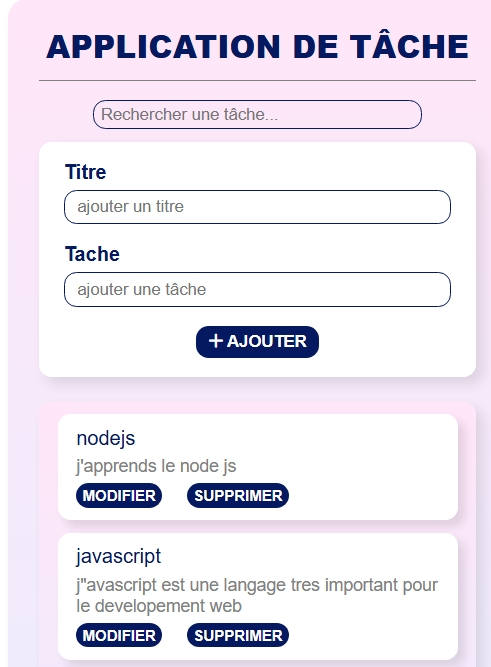

# Todo for Enuska
Une application de gestion de tâches moderne développée avec **Node.js**, **Express.js**, **MongoDB** et **JavaScript**.
Cette application permet de créer, modifier, supprimer et rechercher des tâches dans une interface simple, rapide et intuitive.
---

## Fonctionnalités
Ajouter une tâche, Modifier une tâche, Supprimer une tâche, Rechercher une tâche en temps réel, Validation des données avec Zod, Affichage des messages d'erreur directement dans l'interface, Splash Screen au démarrage, Mise à jour automatique de la liste après chaque opération

---

## Technologies utilisées

### Frontend
HTML5, CSS3, JavaScript (ES6)

### Backend
Node.js, Express.js

### Base de données
MongoDB, Mongoose

### Validation
Zod

---

## Structure du projet

```
Todo-app/
│
├── public/
│   ├── index.html
│   ├── style.css
│   ├── script.js
│__ src/
├   |---controllers/
├   |---routes/
├   |---services/
├   |---models/
├   |---middlewares/
├   |---schemas/
│
├── server.js
├── package.json
└── README.md
```

---

## Installation

### 1. Cloner le projet

```bash
git clone https://github.com/VOTRE-NOM/Todo-app.git
```

### 2. Installer les dépendances

```bash
npm install
```
### 3. Démarrer MongoDB
Assurez-vous que MongoDB est lancé sur votre machine.

### 4. Lancer le serveur
```bash
npm start
```


## Aperçu

L'application comprend :

- Un Splash Screen animé
- Un formulaire d'ajout de tâches
- Une recherche instantanée
- Une liste dynamique des tâches
- Les boutons Modifier et Supprimer
- Les messages d'erreur affichés directement dans l'interface

---

## Objectif du projet

Ce projet a été réalisé afin de mettre en pratique :

- Les opérations CRUD
- La création d'une API REST
- La communication entre Frontend et Backend
- La validation des données avec Zod
- La manipulation de MongoDB avec Mongoose
- Les requêtes Fetch API
- L'organisation d'un projet Full Stack

---

## Améliorations prévues
- Support PWA
- Mode sombre
- Marquer une tâche comme terminée
- Trier les tâches
- Notifications

---

## Auteur

**Enuska Usseni**

Un jeune Développeur de 21ans Full Stack en apprentissage, passionné par le développement web, le design graphique et les nouvelles technologies.

---
## Licence
Ce projet est distribué sous la licence MIT.

## Captures d'écran
### Splash Screen


### Interface principale


